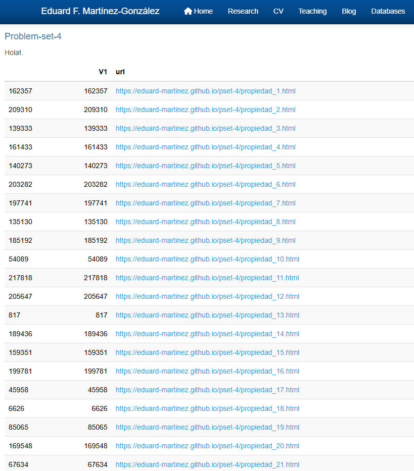

```{r setup, include=FALSE}
knitr::opts_chunk$set(echo = TRUE)
library(rvest)
library(stringr)
library(XML)
library(data.table)
library(sf)
library(ggplot2)
library(viridis)

```

## 1.Extracción de información 

Inicialmente se identifica la fuente del conjunto de datos.

<center>

</center>

### 1.1. Obtención de URLs

Mediante el identificador a y atributo href, recolectamos las URL presentes en la página web

```{r}
dir <- "https://eduard-martinez.github.io/pset-4.html"
tmp <- read_html(dir)
url_full <- html_nodes(tmp, "a") %>% html_attr("href")
```

### 1.2. Filtro de URLs

Del conjunto completo de URLs, seleccionamos aquellas que en la posición 43 contienen la palabra propiedad

```{r}
url_subset <- url_full[which(substring(url_full,42,50)=="propiedad")]
```

### 1.3. Extracción de tablas

En cada iteración del ciclo for:

  1. Leemos el HTML.
  2. Extraemos la informacion que necesitamos de la tabla.
  3. Agregamos dicha información a lista_tablas.
  
```{r}

lista_tablas <- vector("list",3)
i <- 1

for (dir in url_subset){
  #Leemos el HTML
  tmp <- read_html(dir)
  
  # De la tabla contenida en tbody, separamos la información identificada con td
  tabla <- html_nodes(tmp, "tbody") %>% html_elements("td") 
  # guardamos y extraemos los datos que necesitamos
  lon_lat <- tabla[12] %>% html_text2()
  price <- tabla[8] %>% html_text2()
  
  #Y agregamos los elementos a la lista de tablas
  lista_tablas[[i]] <- list(coordenadas = lon_lat, precio = price)
  
  i <- i + 1
}

```

### 1.4. Preparando de la información

Utilizando la función `rbindlist()`, se agrupan las listas por nombre.

```{r}
db_house <- rbindlist(lista_tablas, use.names=TRUE)

#Convertimos la columna precio a tipo num
db_house$precio <- as.numeric(db_house$precio)
```

## 2. Manipulando la información

### 2.1. Creación de objeto sf

```{r}
sf_house <- st_as_sf(db_house, wkt = "coordenadas")
```

### 2.2. Pintando el mapa

Se utilizan las funciones `geom_sf()` y `scale_color_viridis()` para gráficas los puntos almacenados.

```{r}
ggplot() + geom_sf(data = sf_house, aes(colour = precio)) + scale_color_viridis()
```